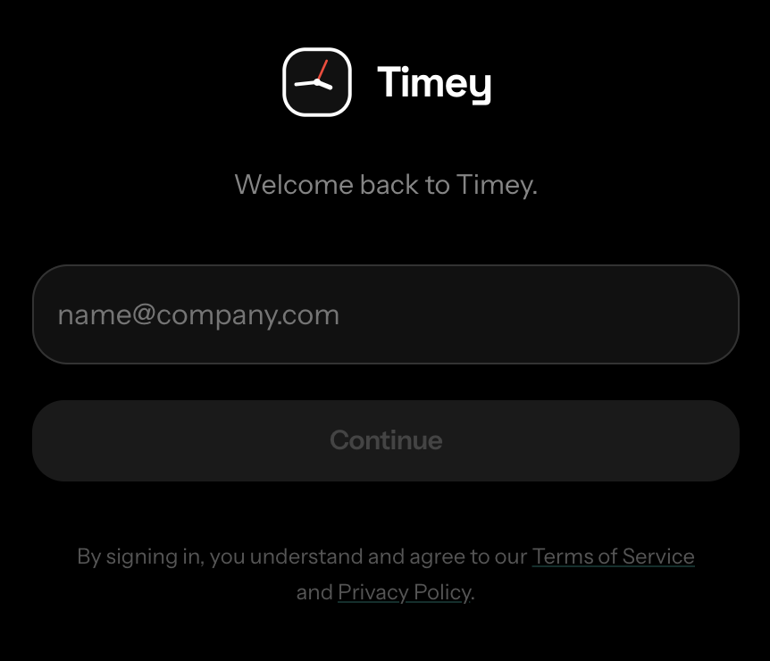

# Timey


[](./LICENSE)
[](https://www.typescriptlang.org/)
[](https://react.dev/)
[](https://tanstack.com/start)
[](https://spacetimedb.com/)
[](https://bun.sh/)
[](./CONTRIBUTORS.md)

Timey is an open-source employee, project, and time management platform for modern teams.  
It combines passwordless access, organization onboarding, member management, and real-time collaboration into one fast web app.

## What You Get

- Passwordless OTP authentication with server-side sessions
- Workspace onboarding (create or join by workspace code)
- Team membership and invite flows
- Realtime collaboration powered by SpacetimeDB
- Global time awareness for distributed teams
- Clean TypeScript-first codebase ready for open-source contribution

## Screenshots



## Product Direction

Timey is built to become a full operating layer for:

- Employee management
- Project management
- Time and coordination management

Current release focuses on identity, workspace setup, members, invites, chat, and real-time foundations.  
Project/task planning and deeper time tracking can be added on top of the existing schema and reducer model.

## Tech Stack

- Frontend: React 19 + TanStack Start + TanStack Router + React Query
- UI: MUI
- Backend runtime: TanStack Start server functions
- Realtime data layer: SpacetimeDB
- Auth: Email OTP + signed session cookie
- Package manager/runtime: Bun

## Quick Start

### 1. Install dependencies

```bash
bun install
```

### 2. Configure environment

Create `.env.local`:

```bash
SESSION_SECRET=change-me
ZEPTOMAIL_TOKEN=your-zeptomail-token
VITE_SPACETIMEDB_HOST=https://maincloud.spacetimedb.com
VITE_SPACETIMEDB_DB_NAME=timeydb
```

### 3. Run locally

```bash
bun run dev
```

App runs at `http://localhost:5173`.

## SpacetimeDB Workflow

When changing schema/reducers in `spacetimedb/src/index.ts`:

```bash
bun run spacetime:generate
```

To publish module updates:

```bash
bun run spacetime:publish
```

To build the module directly:

```bash
bun --cwd spacetimedb run build
```

## Scripts

- `bun run dev` start local dev server
- `bun run build` build production assets
- `bun run preview` preview production client build
- `bun run start` run generated server output
- `bun run spacetime:generate` regenerate client bindings
- `bun run spacetime:publish` publish SpacetimeDB module

## Project Structure

```text
src/
  components/       UI and feature components
  hooks/            auth and data hooks
  routes/           file-based app routes
  server/           server functions (OTP, invites, sessions)
  module_bindings/  generated SpacetimeDB bindings (do not edit)
spacetimedb/
  src/index.ts      schema + reducers
```

## Open Source Roadmap

- [x] OTP auth and session lifecycle
- [x] Organization onboarding and workspace joins
- [x] Member invites and workspace membership
- [x] Realtime team chat foundations
- [x] Multi-timezone awareness primitives
- [ ] Project entities, milestones, and ownership
- [ ] Task boards and workflow states
- [ ] Time entries, attendance, and reporting
- [ ] Role-based permissions and audit trails

## Implementation Status (March 6, 2026)

### Done

- Chat page supports threaded replies, reactions, message editing, mentions, emoji picker, and read-state sync.
- Global right-side messenger panel is available outside `/chat`.
- Messenger supports both direct messages and group channels.
- Floating chat windows open from the messenger panel.
- Maximum 2 floating chat windows are kept open; opening a third replaces the oldest open window.
- Floating thread view now opens as a full thread screen in the same chat card with a top back button.
- Online/offline presence is global (not only `/chat`) via SpacetimeDB heartbeat updates.
- Topbar user profile shows live online/offline status.
- Incoming message sound plays when user is away from active chat context.
- System notifications for incoming messages work when user is away and notification permission is granted.
- Message input and message list UI in floating chat are aligned with shared chat components.

### To Do

- Closed-tab/browser push notifications (requires Service Worker + Push API + backend Web Push).
- Notification preferences UI (sound on/off, desktop notification toggle, channel-level controls).
- Additional mobile refinements for floating messenger behavior.
- More chat QA coverage for reconnect/offline/online transitions and multi-account switching.

## Contributors

- [@luckycrm](https://github.com/luckycrm)
- Full list: [CONTRIBUTORS.md](./CONTRIBUTORS.md)

## Contributing

Contributions are welcome.

1. Fork the repo
2. Create a branch (`feat/your-feature`)
3. Commit with clear messages (`feat: ...`, `fix: ...`)
4. Open a pull request with screenshots/notes when UI changes are included

Generated files like `src/module_bindings/` and `src/routeTree.gen.ts` should not be manually edited.

Read:

- [Contributing Guide](./CONTRIBUTING.md)
- [Contributors](./CONTRIBUTORS.md)
- [Code of Conduct](./CODE_OF_CONDUCT.md)
- [Security Policy](./SECURITY.md)
- [Support](./SUPPORT.md)
- [Governance](./GOVERNANCE.md)

Automated review:

- CodeRabbit checks are configured via [`.coderabbit.yaml`](./.coderabbit.yaml)
- Install/enable the CodeRabbit GitHub App on this repository to activate PR checks

## Security Notes

- Keep secrets in `.env.local`
- Never commit production keys
- Rotate `SESSION_SECRET` and mail credentials regularly

## Funding

If this project helps your team, support ongoing development via GitHub Sponsors.

## License

Licensed under Apache 2.0. See [LICENSE](./LICENSE).
